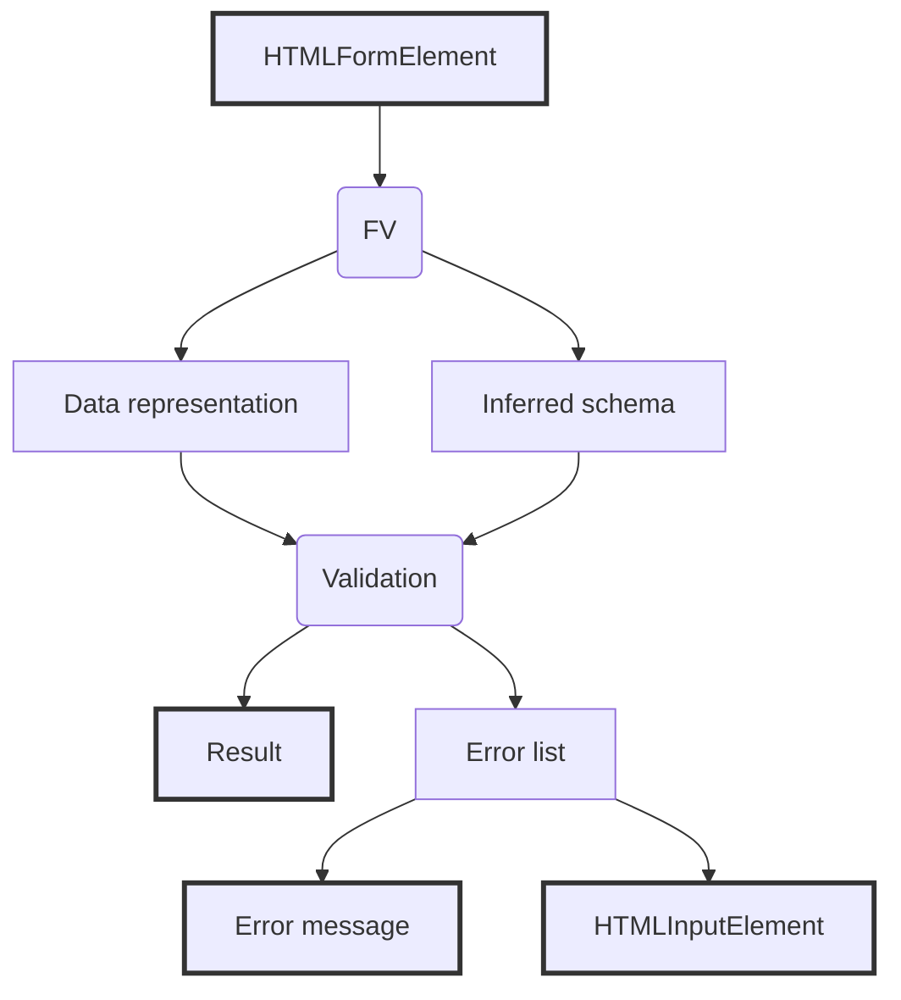

# Biblioteca de Validação de Schemas

Esta biblioteca fornece um motor de validação declarativo inspirado em bibliotecas como Yup.  
O foco é mantê-la simples de usar.

---

## 1. Conceitos Fundamentais

### 1.1 Schema

Um **Schema** descreve como um dado deve ser validado. Ele **não transforma o dado final**, apenas valida.

Exemplo 1:
```js
const schema = new Schema({
  age: SR.number().min(18)
});
```

Exemplo 2:
```js

const data = {age: 27};
await schema.validate(data);
```

Exemplo 3:
```js
const age = SR.number().min(18);
const schema = new Schema(age);
const data = 27;
await schema.validate(data);
```
Exemplo 4
```js
// Definição de regras novas
SR.extend({
    age: SR.number().min(18),
    password: SR
            .string()
            .min(8)
            .matches(/[A-Z]/)
            .matches(/[a-z]/)
            .matches(/[0-9]/)
            .matches(/[@#$%!*]/)
});

// Definição de schema
const formRules = {
    age: SR.age(),
    userPassword: SR.password(),
    confirmPassword: SR.equal(SR.ref('userPassword')),
    email: SR.email()
};
const formSchema = new Schema(formRules);

// utilização do schema
await schema.validate(profileData);
```

Se a validação falhar, uma exceção `DataTypeError` será lançada.

---

### 1.2 SR (Schema Rules)

`SR` é a API fluente usada para construir regras de validação.

Cada chamada retorna **uma nova instância imutável** de regra.

```js
SR.string().min(3).required()
```

---

## 2. Validação Básica

### 2.1 Tipos Primitivos

| Regra | Descrição |
|-----|---------|
| `SR.string()` | Valor deve ser string |
| `SR.number()` | Valor deve ser número |
| `SR.integer()` | Número inteiro |
| `SR.object()` | Objeto (não array) |
| `SR.array()` | Array |
| `SR.email()` | Email válido |

Exemplo:

```js
const schema = new Schema({
  email: SR.string().email()
});
```

---

### 2.2 Regras Numéricas e de Comparação

| Regra | Descrição |
|------|-----------|
| `.min(value)` | Valor >= value (ou length para string) |
| `.max(value)` | Valor <= value |
| `.equal(value)` | Igualdade estrita |
| `.oneOf(array)` | Deve pertencer à lista |
| `.matches(regex)` | Regex |

```js
SR.number().min(10).max(100)
```

---

## 3. required e nullable

### 3.1 `.required()`

Falha se o valor for:
- `null`
- `undefined`
- string vazia (`''`)

```js
SR.string().required()
```

---

### 3.2 `.nullable()`

Permite que o valor seja nulo.

Quando o valor é nulo:
- todas as regras subsequentes são ignoradas

```js
SR.number().nullable().min(10)
```

> ⚠️ `required()` e `nullable()` **não podem coexistir**.

---

## 4. shape — Objetos Aninhados

Usado para validar objetos com estrutura interna.

```js
const schema = new Schema({
  user: SR.shape({
    name: SR.string().required(),
    age: SR.number().min(18)
  })
});
```

Regras não podem ser aplicadas **antes** ou **depois** de `shape()`.

---

## 5. .of() — Validação de Arrays

Valida cada item de um array usando outro schema.

```js
const schema = new Schema({
  scores: SR.array().of(
    SR.number().min(0).max(100)
  )
});
```

Se algum item falhar, o erro será retornado por índice:

```js
{
  scores: [undefined, ['This value exceeds the allowed maximum.']]
}
```

---

## 6. SR.ref() — Referências Cruzadas

Permite referenciar valores **do root do schema**.

```js
SR.number().min(SR.ref('minValue'))
```

### Características importantes:
- Sempre resolve a partir do **root original**
- Não observa valores transformados
- Paths profundos são permitidos:

```js
SR.ref('user.profile.age')
```

Se o caminho não existir, retorna `undefined`.

---

## 7. custom — Validações Customizadas

### 7.1 Assinatura da Função

```js
custom(value, ...resolvedParams, data)
```

Onde:
- `value`: valor atual do campo
- `resolvedParams`: parâmetros passados (incluindo `SR.ref()` resolvido)
- `data`: root completo

```js
SR.custom((value, min, data) => {
  return value >= min;
}, SR.ref('minValue'))
```

### 7.2 Regras assíncronas

```js
SR.custom(async (value) => {
  await delay(50);
  return value !== 'admin';
})
```

### ⚠️ Contrato Importante

Se um `custom` lançar uma exceção:
- a validação é abortada
- **não é considerado erro de dado**
- a exceção é propagada

Isso indica **bug na validação**, não no input.

---

## 8. transform — Pipeline de Valor

Permite modificar o valor **apenas para regras subsequentes do mesmo campo**.

```js
SR.string()
  .transform(v => v.trim())
  .min(3)
```

### Propriedades:
- Não altera o dado original
- Não afeta `SR.ref()`
- Modifica apenas `ctx.value`

---

## 9. Registro e Extensão de Regras

### 9.1 SR.register

```js
SR.register('between', (value, min, max)=>{
    if (value < min){
        return false;
    }
    return (value <= max);
},'{name} must be between {0} and {1}');
```

Uso:

```js
SR.between(10, 20);
```

---

### 9.2 SR.extend

Registra múltiplas regras de uma vez.

```js
SR.extend({
  positive: SR.number().min(0),
  shortText: SR.string().max(10)
});
```

---

## 10. Mensagens de Erro

### 10.1 Mensagens Padrão

Cada regra possui uma mensagem default.

---

### 10.2 `.error()` — Mensagem Customizada

```js
SR.string().min(8).error('{name} must have {0} chars')
```

Tokens suportados:
- `{name}` — nome do campo
- `{value}` — valor atual
- `{0}`, `{1}` — parâmetros resolvidos

---

### 10.3 Mensagens Dinâmicas

```js
SR.string().error((ctx, params) => {
  return `${ctx.name} must be at least ${params[0]}`;
})
```

---

## 11. Execução da Validação

```js
try {
  await schema.validate(data);
} catch (err) {
  if (err instanceof DataTypeError) {
    console.log(err.report);
  }
}
```

### Estrutura do `report`

```js
{
  fieldName: [ 'error message' ],
  nested: {
    field: ['error']
  }
}
```

---

## 12. Invariantes do Sistema (Contrato Oficial)

1. `SR.ref()` sempre lê do root original
2. `transform` não altera o root
3. Regras são executadas em ordem
4. `ctx` é mutável **apenas dentro do campo**
5. Exceções em regras indicam erro de implementação
6. `DataTypeError` indica erro de dado

---

## 13. Conclusão

Esta biblioteca prioriza:
- clareza de contratos
- ausência de mágica
- falhas explícitas

Ela é adequada para ambientes onde **bugs de validação devem ser visíveis**, não mascarados.

---


# FV — Form Validation

Esta camada fornece uma integração direta entre **HTML Forms** e o motor de validação de schemas (`Schema` / `SR`).

O objetivo do `FV` é:
- ler dados diretamente do DOM
- normalizar os valores de inputs HTML
- construir um **schema temporário** a partir de atributos do formulário
- executar a validação usando o core da biblioteca

O `FV` **não interpreta regras**, **não executa lógica de validação própria** e **não mascara erros de schema**.

---

## 1. Conceito Geral

O fluxo completo é:

1. Desenvolvedor descreve regras diretamente no HTML (via atributos)
2. `FV` lê o formulário
3. `FV` constrói um schema com `SR`
4. `Schema.validate` é executado
5. Resultado normalizado é retornado para uso no front-end



---

## 2. Criando uma Instância de FV

### Assinatura

```js
new FV(formElement)
```

### Parâmetros

| Nome | Tipo | Descrição |
|----|----|----|
| `formElement` | `HTMLFormElement` | Referência obrigatória para um `<form>` |

### Exemplo

```js
const form = document.querySelector('#user-form');
const fv = new FV(form);
```

Se o parâmetro não for um `HTMLFormElement`, uma exceção será lançada.

---

## 3. Leitura e Normalização do Formulário

### `fv.readForm()`

Lê os valores atuais do formulário e retorna um objeto normalizado.

```js
const data = fv.readForm();
```

### Normalização aplicada

| Elemento | Resultado |
|-------|----------|
| `input[type=text]` | `string` |
| `input[type=radio]` | valor selecionado ou `null` |
| `input[type=checkbox]` (1 campo) | valor ou `null` |
| `input[type=checkbox]` (grupo) | `array` |
| `select[multiple]` | `array` |
| `disabled` | ignorado |

### Exemplo

```html
<input type="checkbox" name="agree" value="yes">
```

```js
{ agree: null } // não marcado
```

---

## 4. Construção do Schema a partir do HTML

### `fv.buildSchema()`

Constrói um schema temporário com base nos atributos dos elementos do formulário.

```js
const schema = fv.buildSchema();
```

O schema é criado **uma única vez** e reutilizado nas validações subsequentes.

---

## 5. Atributos de Validação no HTML

### 5.1 `name` (obrigatório)

Todo campo validado **deve possuir `name`**.

```html
<input name="email">
```

Campos sem `name` são ignorados.

---

### 5.2 `data-type`

Define a regra base a ser usada a partir de `SR`.

```html
<input name="email" data-type="email">
```

Equivale a:

```js
SR.email()
```

Se o valor não existir em `SR`, um `BadSchemaError` será lançado.

---

### 5.3 `required`

Campo obrigatório.

```html
<input name="username" required>
```

Equivale a:

```js
SR.required()
```

---

### 5.4 `nullable`

Permite valor `null`.

```html
<input name="nickname" nullable>
```

> ⚠️ A presença do atributo ativa `nullable`, independentemente do valor.

---

### 5.5 `data-ref`

Cria uma igualdade estrita com outro campo do formulário.

```html
<input name="password" data-type="string" required>
<input name="confirm" data-type="string" data-ref="password" required>
```

Equivale a:

```js
SR.equal(SR.ref('password'))
```

### Propriedades importantes

- comparação estrita (`===`)
- valor lido do root original
- não observa `transform`

---

## 6. Ordem de Composição das Regras

A ordem de aplicação das regras **é fixa**:

1. `required`
2. `nullable`
3. `data-ref` (`equal(ref)`)
4. `data-type`

Essa ordem **não depende** da posição dos atributos no HTML.

---

## 7. Campos sem Regras

Campos que possuem `name`, mas **nenhum atributo de validação**, são aceitos automaticamente.

```html
<input name="comments">
```

Equivale a:

```js
SR.noop()
```

---

## 8. Validação do Formulário

### `fv.validate(abortEarly?)`

Executa a validação completa do formulário.

```js
const result = await fv.validate();
```

### Retorno

```js
{
  valid: boolean,
  errors: null | Record<string, {
    element: HTMLElement,
    messages: string[]
  }>
}
```

---

### Exemplo completo

```html
<form id="login">
  <input name="email" data-type="email" required>
  <input name="password" data-type="string" required>
</form>
```

```js
const fv = new FV(document.querySelector('#login'));
const result = await fv.validate();

if (!result.valid) {
  Object.values(result.errors).forEach(err => {
    err.element.classList.add('error');
    console.log(err.messages);
  });
}
```

---

## 9. abortEarly

```js
await fv.validate(true);
```

Quando `true`, a validação para no primeiro erro encontrado.

---

## 10. Erros e Contratos

### 10.1 Erro de dado

- Representado por `DataTypeError`
- Retornado como `{ valid: false }`

---

### 10.2 Erro de validação

- Exceção normal (`Error`)
- Indica bug de schema ou regra
- **Não é capturado nem convertido**

---

## 11. Exemplos Avançados

### Checkbox múltiplo

```html
<input type="checkbox" name="roles" value="admin">
<input type="checkbox" name="roles" value="user">
```

```js
{ roles: ['admin'] }
```

---

### Select múltiplo

```html
<select name="tags" multiple>
  <option value="a" selected>A</option>
  <option value="b">B</option>
</select>
```

```js
{ tags: ['a'] }
```

---

## 12. Invariantes do FV

1. FV não altera o DOM
2. FV não transforma dados além da normalização
3. Schema é criado uma única vez
4. Erros de schema são propagados
5. HTML descreve regras, não lógica

---

## 13. Conclusão

`FV` é uma camada declarativa que conecta HTML e validação sem mágica implícita.

Ela é adequada para cenários onde:
- o HTML é fonte de verdade
- erros de validação devem ser explícitos
- bugs de schema não devem ser escondidos

---
